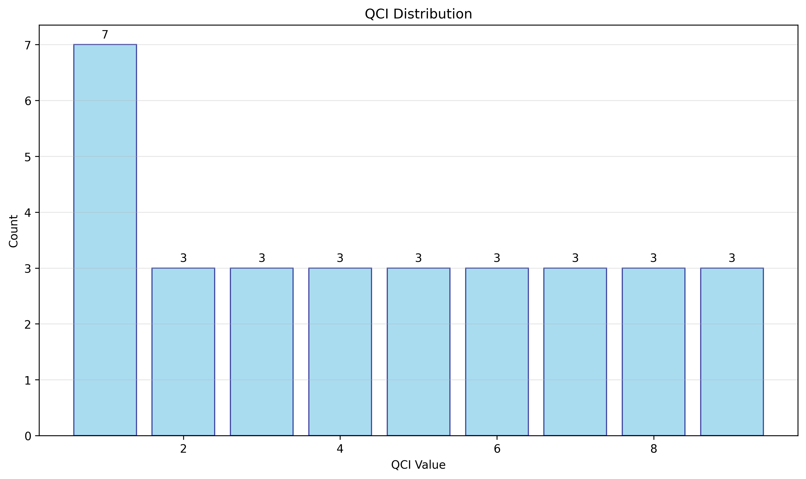
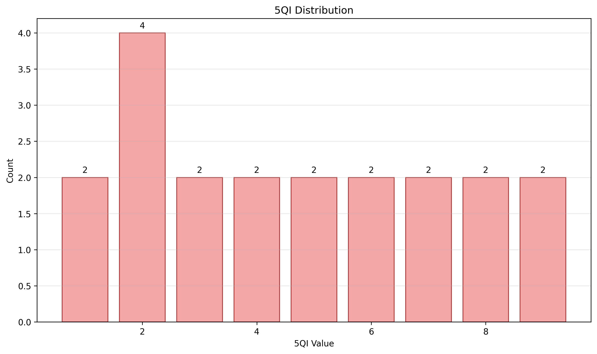

# QCI/5QI Analysis Report

**Generated:** 2025-09-01 15:21:38  
**Dataset:** 6 files, 41 total rows  
**Time Span:** 2024-07-31 14:42:13.123000+00:00 to 2024-07-31 14:42:22.012000+00:00  
**Analysis Window:** 5min

## Dataset Summary

### Files Processed
- **minimal.csv**: 10 rows, has QCI, has 5QI, has timestamps
- **minimal.csv**: 10 rows, has QCI, has 5QI, has timestamps
- **qci_distribution.csv**: 9 rows, has QCI
- **anomalies_by_bearer.csv**: 1 rows
- **5qi_distribution.csv**: 9 rows, has 5QI
- **mismatches.csv**: 2 rows, has QCI, has 5QI, has timestamps

**Total Rows:** 41  
**Available Columns:** timestamp, qci, 5qi, imsi, bearer_id, throughput, latency, packet_loss, _source_file, count, percentage, time_window, type, unique_5qis, row_count, row_index, expected_5qi

## Methods

- **Parsing Rules:** Auto-discovery of CSV/TSV/JSON files with column normalization
- **Mapping Source:** configs/qci_5qi_map.yaml
- **Time Windows:** Data aggregated using specified window size
- **Mismatch Detection:** QCI/5QI pairs validated against mapping configuration

## Results

### QCI Distribution

| QCI | Count | Percentage |
|-----|-------|------------|
| 1.0 | 7 | 22.58% |
| 2.0 | 3 | 9.68% |
| 3.0 | 3 | 9.68% |
| 4.0 | 3 | 9.68% |
| 5.0 | 3 | 9.68% |
| 6.0 | 3 | 9.68% |
| 7.0 | 3 | 9.68% |
| 8.0 | 3 | 9.68% |
| 9.0 | 3 | 9.68% |

**Total QCI Entries:** 31



### 5QI Distribution

| 5QI | Count | Percentage |
|-----|-------|------------|
| 1.0 | 3 | 9.68% |
| 2.0 | 7 | 22.58% |
| 3.0 | 3 | 9.68% |
| 4.0 | 3 | 9.68% |
| 5.0 | 3 | 9.68% |
| 6.0 | 3 | 9.68% |
| 7.0 | 3 | 9.68% |
| 8.0 | 3 | 9.68% |
| 9.0 | 3 | 9.68% |

**Total 5QI Entries:** 31



### QCI/5QI Mapping Analysis

**Mismatch Rate:** 18.18% (4/22 comparisons)

**Top Mismatches:**

| QCI | 5QI | Expected 5QI | IMSI | Bearer ID |
|-----|-----|---------------|------|----------|
| 1 | 2 | [1] | 123456789012345.0 | ebi_1 |
| 1 | 2 | [1] | 123456789012345.0 | ebi_1 |
| 1 | 2 | [1] | 123456789012345.0 | ebi_1 |
| 1 | 2 | [1] | 123456789012345.0 | ebi_1 |

*See artifacts/mismatches.csv for complete list*

### Bearer/IMSI Consistency Findings

**Anomalies Detected:** 1

**5QI Variability:** 1 bearers with multiple 5QI values in single time window

*See artifacts/anomalies_by_bearer.csv for detailed analysis*

### KPI Summary

**KPI Statistics by QCI:**

- **QCI 1:**
  - throughput: mean=11.3, median=11.3, range=[10.5, 12.1] (n=4)
  - latency: mean=52.5, median=52.5, range=[50.0, 55.0] (n=4)
  - packet_loss: mean=0.01, median=0.01, range=[0.01, 0.01] (n=4)

- **QCI 2:**
  - throughput: mean=25.3, median=25.3, range=[25.3, 25.3] (n=2)
  - latency: mean=80.0, median=80.0, range=[80.0, 80.0] (n=2)
  - packet_loss: mean=0.02, median=0.02, range=[0.02, 0.02] (n=2)

- **QCI 5:**
  - throughput: mean=5.1, median=5.1, range=[5.1, 5.1] (n=2)
  - latency: mean=30.0, median=30.0, range=[30.0, 30.0] (n=2)
  - packet_loss: mean=0.001, median=0.001, range=[0.001, 0.001] (n=2)

- **QCI 7:**
  - throughput: mean=15.2, median=15.2, range=[15.2, 15.2] (n=2)
  - latency: mean=60.0, median=60.0, range=[60.0, 60.0] (n=2)
  - packet_loss: mean=0.015, median=0.015, range=[0.015, 0.015] (n=2)

- **QCI 9:**
  - throughput: mean=100.7, median=100.7, range=[100.7, 100.7] (n=2)
  - latency: mean=120.0, median=120.0, range=[120.0, 120.0] (n=2)
  - packet_loss: mean=0.03, median=0.03, range=[0.03, 0.03] (n=2)

- **QCI 8:**
  - throughput: mean=75.4, median=75.4, range=[75.4, 75.4] (n=2)
  - latency: mean=90.0, median=90.0, range=[90.0, 90.0] (n=2)
  - packet_loss: mean=0.025, median=0.025, range=[0.025, 0.025] (n=2)

- **QCI 3:**
  - throughput: mean=8.9, median=8.9, range=[8.9, 8.9] (n=2)
  - latency: mean=40.0, median=40.0, range=[40.0, 40.0] (n=2)
  - packet_loss: mean=0.005, median=0.005, range=[0.005, 0.005] (n=2)

- **QCI 6:**
  - throughput: mean=45.6, median=45.6, range=[45.6, 45.6] (n=2)
  - latency: mean=100.0, median=100.0, range=[100.0, 100.0] (n=2)
  - packet_loss: mean=0.02, median=0.02, range=[0.02, 0.02] (n=2)

- **QCI 4:**
  - throughput: mean=30.2, median=30.2, range=[30.2, 30.2] (n=2)
  - latency: mean=70.0, median=70.0, range=[70.0, 70.0] (n=2)
  - packet_loss: mean=0.018, median=0.018, range=[0.018, 0.018] (n=2)

## Anomalies and Recommendations

⚠️ **High Mismatch Rate:** Consider reviewing QCI/5QI mapping configuration

⚠️ **Bearer Inconsistencies:** Multiple QCI/5QI values detected for individual bearers

### Data Quality Recommendations

- Verify mapping configuration matches network operator policy
- Investigate high mismatch rates with network engineering team
- Consider longer time windows if bearer variability is expected
- Validate data collection processes for consistency

## Appendix

**CLI Arguments:**
- Input Directory: samples
- Output Directory: samples/output
- Mapping File: configs/qci_5qi_map.yaml
- Time Window: 5min

**Environment:**
- Python: 3.12.3
- Pandas: 2.3.2
- Analysis Tool: QCI/5QI Pipeline v1.0

**Mapping Configuration Excerpt:**
```yaml
  "1": [1]
  "2": [2]
  "3": [3]
  "4": [4]
  "5": [5]
  ...
```

**Generated Artifacts:**
- artifacts/qci_distribution.csv
- artifacts/anomalies_by_bearer.csv
- artifacts/5qi_distribution.csv
- artifacts/mismatches.csv
- images/qci_distribution.png
- images/5qi_distribution.png
- images/qci_timeseries.png
